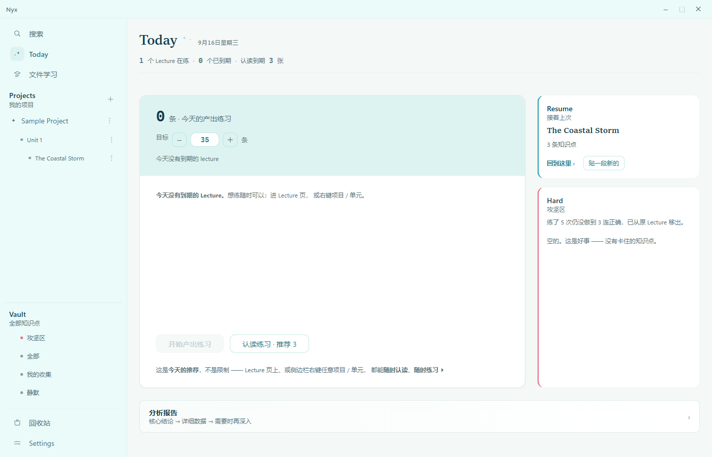
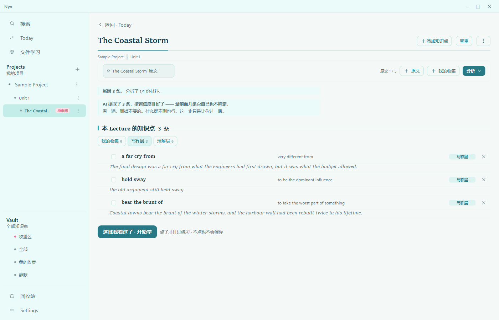
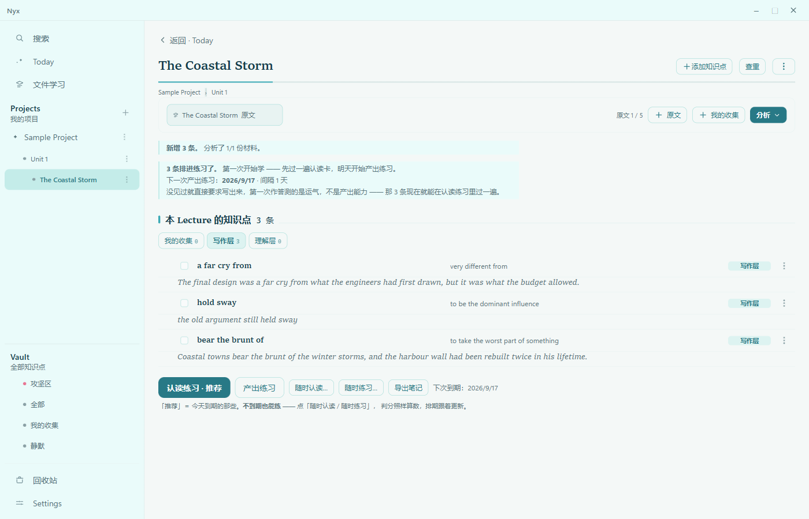
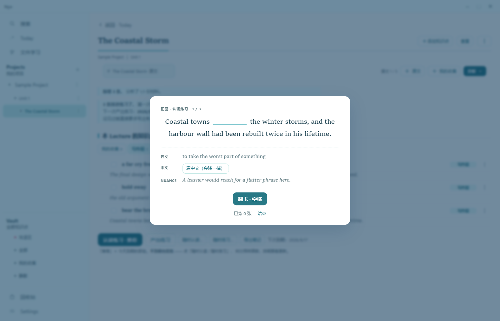
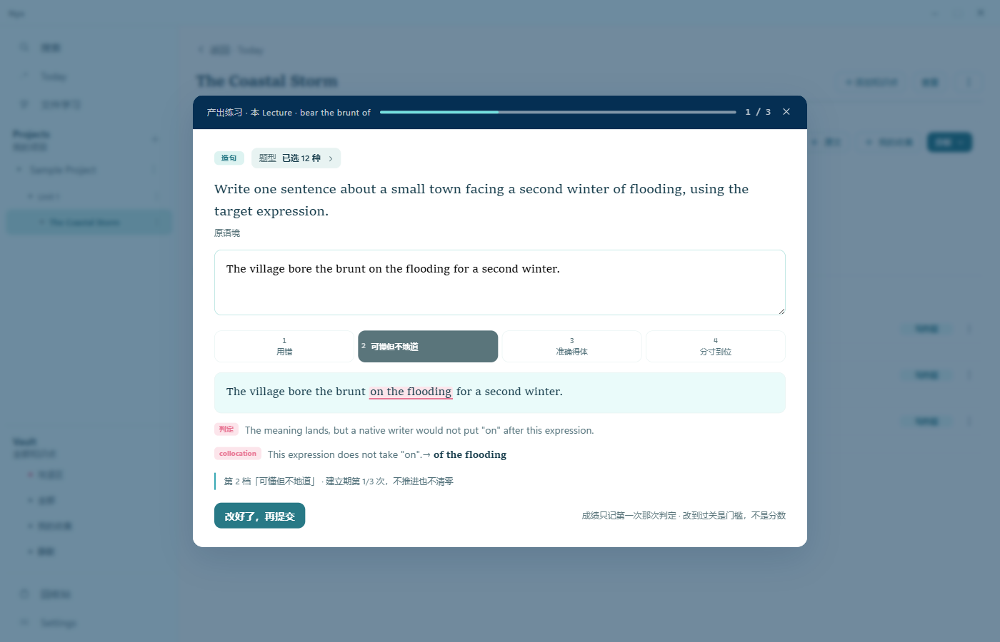
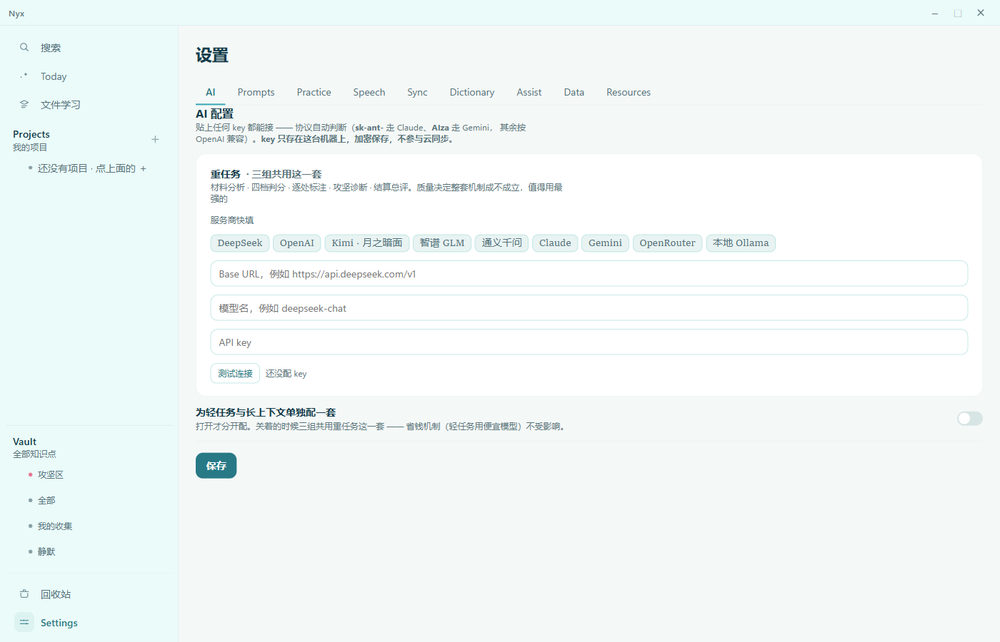

# Nyx

**Turn English you actually read into English you can actually produce.**

Nyx takes a piece of English — an article, a paragraph, a sentence you saved — and pulls out the
expressions worth learning, each one carrying the sentence it came from. It then drills you on them
until you can produce them, not merely recognise them. A desktop app does the reading and the heavy
work; an Android companion follows you into every other app on your phone.

> 中文说明：[README.zh-CN.md](README.zh-CN.md)
>
> **The interface is in Chinese.** Nyx is a personal project, built for and used daily by its
> author, published so that others can read the code and the design. This page and the source are
> in English; the application is not.

---

## Download — v0.1.0

### ⬇ [Windows — portable .zip, 146 MB](https://github.com/Lizhiying1234/nyx-app/releases/download/v0.1.0/Nyx-windows-v0.1.0-portable.zip)

### ⬇ [Android — .apk, 72 MB](https://github.com/Lizhiying1234/nyx-app/releases/download/v0.1.0/Nyx-android-v0.1.0-debug.apk)

[All releases](https://github.com/Lizhiying1234/nyx-app/releases) · [Full release notes](https://github.com/Lizhiying1234/nyx-app/releases/tag/v0.1.0)

Two things are not in the download: an **API key** from an AI provider, which analysis and practice
require, and **dictionaries**, which are optional. Any provider works — DeepSeek, OpenAI, Claude,
Gemini, Kimi, GLM, Qwen, OpenRouter, or a local Ollama — and the protocol is detected from the key
itself. See [Getting started](#getting-started).

- **Windows** is portable — unzip, run `Nyx.exe`, nothing is installed and nothing is written to the
  registry. Do **not** unzip into `C:\Program Files`; that location is not writable by default and
  the app will fail to start. Windows shows a SmartScreen warning because this build is not
  code-signed.
- **Android** is debug-signed and sideloaded. Upgrading later means uninstalling first, and
  **uninstalling an Android app deletes its local data** — export or sync your library before you
  uninstall anything.

---

## What it looks like

Windows. The interface is in Chinese; the captions below say what each screen is doing.



*Today — what to practise, and how much. The number is a recommendation, not a cap. On the right:
pick up where you left off, and a "hard zone" that collects items which keep failing.*



*What comes back from an analysis: expressions ranked by the AI's own confidence, **each carrying the
sentence it was taken from** (in italics). Nothing gets scheduled until you press the button at the
bottom — looking the batch over is a deliberate step, and deleting nothing is a valid outcome.*



*A Lecture is the workbench for one piece of material: the text, what was extracted from it, both
practice tracks, and when it comes up next. New items always go through recognition first — asking
someone to produce an expression they have never seen measures luck, not ability.*



*A recognition drill: the source sentence with the expression removed, its meaning, and a note on
register. You flip the card and grade yourself on four tiers.*



*A production drill — the reason the rest of it exists. The answer is graded on four tiers; this one
lands on tier 2, "understandable but not idiomatic", and the grading points at exactly what is
wrong: `on the flooding` should be `of the flooding`. Only the first attempt counts towards
progress, so rewriting it teaches you something instead of inflating a number.*



*Settings → AI. Paste a key from any provider; the protocol is worked out from the key itself. The
page states plainly that the key stays on this machine, encrypted, and never takes part in sync.*

---

## The problem it was built for

Most vocabulary tools are built around recognition. You are shown a word and four options, you pick
one, the tool records that you know it. But recognising a word in a list is not the same skill as
reaching for it in the middle of your own sentence. It is common to have "learned" thousands of
words this way and still write flat, cautious prose, because nothing along the way ever asked you to
produce anything.

Nyx starts from the opposite assumption: **the only evidence that an expression is yours is that you
produced it.** Every design decision below follows from that one.

## How it works

```
   paste English text
          |
          v
   AI analysis  ────────>  knowledge points, each carrying its source sentence,
          |                split across two layers:
          |                  [A] comprehension — you need to understand it
          |                  [B] production    — you should be able to write it
          v
   practice ──────┬──────>  recognition drills   (does it register?)
                  └──────>  production drills    (can you produce it?)
                                   |
                                   v
                       four-tier scoring and diagnosis
                                   |
                                   v
                        what to practise next, and when
```

## What it does

### Reading and extraction

- Paste an article and get back knowledge points — expressions, patterns, collocations — **each one
  carrying the original sentence it was taken from.** Nothing enters the library without a source.
- Save sentences you collected yourself, and have them broken down into their parts.
- Read an article alongside an AI tutor.
- Ask for a full analysis of any single item: how it works, when it is used, what it is not.

### Practice

- **Recognition drills** and **production drills**, deliberately kept apart.
- Production questions come in five forms, and **multiple choice is not one of them** — neither is
  matching, nor gap-fill with a list of options to choose from. If the answer is somewhere on the
  screen, the question is measuring the wrong thing.
- Answers are graded on a **four-tier pragmatic scale**, and grading is required to be reproducible:
  if the same answer scores differently tomorrow, progress is noise.
- Diagnosis runs in two directions — down a single item over time, and across one round of practice.

### Your library

- Items are organised into Lectures and units. Nothing is discarded quietly.
- An item you are finished with is made **silent** rather than deleted: it stops appearing, it does
  not stop existing.
- Deleted items wait in a recycle bin for ten days before they are really gone.
- Local dictionaries are supported in two formats: **MDict** (`.mdx`, with `.mdd` resource files)
  and **StarDict** (`.ifo`). Without any dictionary the app still works — examples are generated by
  the AI and labelled as such.
- Text to speech, either from a dictionary's own audio or from a system or cloud voice.

### Your data

- Everything lives in one SQLite database in `data/`, next to the executable. Copy that folder and
  you have moved the entire installation to another machine.
- The database is **append-only by design**: numbered migrations, an automatic backup on every
  launch and again before every schema upgrade, ten backups kept, automatic rollback if an upgrade
  fails.
- Optional sync between the two ends over **WebDAV** or **Supabase Storage**. Sync credentials stay
  on the device, and so does your API key — neither is ever uploaded.

## Windows and Android are not the same application

Both ends share one core — the same extraction rules, the same grading, the same database schema —
but they are deliberately asymmetric.

| | Windows | Android |
|---|---|---|
| Read and analyse long material | the main place you do it | not offered, by design |
| Capture a sentence you liked | yes | yes |
| Look words up **inside other apps** | — | yes; this is the point of it |
| Practice, recognition and production | yes | yes |
| Analyse a single item | yes | yes |
| Edit an item's term and meaning | yes | yes |
| Reports, statistics, scheduling | yes | not offered, by design |
| Re-categorise or re-file items | yes | not offered, by design |

The phone is meant for the minutes you have while queuing, not as a second desktop. Its distinctive
feature is **Assist**: an accessibility service that lets you select text in any other application —
a browser, a chat, a PDF reader — and look it up or save it into your library without leaving that
application.

## Design decisions you will notice

- **Every knowledge point carries its source sentence.** An expression without the context it
  appeared in is a flashcard, not a piece of language.
- **The AI never translates whole sentences for you.** Explanations are in English wherever
  possible; only grammar notes are written in Chinese.
- **Prompts are files, not code.** Everything the AI does lives in `prompts/*.md`. Open one in a
  text editor, change it, save it, and the next analysis uses your version. Delete it and the
  built-in one takes over.
- **Silence is not deletion, and deletion is not immediate.**
- **The interface holds no copy of your data.** SQLite is the single source of truth; the UI never
  touches the database or the AI directly.

## Getting started

### Windows

1. Unzip anywhere except `C:\Program Files` — somewhere like `D:\Nyx` is fine. Run `Nyx.exe`.
2. Settings → AI: paste your API key, save, then **Test connection**. Any provider works and the
   protocol is detected from the key. The key is encrypted, stored on that machine only, never
   uploaded and never synced.
3. Home → Start: paste an English text and run the analysis.
4. Review what was extracted, then begin learning.
5. Optional — dictionaries: put each dictionary in its own folder under `data/dicts/`, then
   Settings → Dictionaries → Rescan.

A Chinese manual, `使用说明.md`, ships inside the folder.

### Android

1. Sideload the APK; Android will ask you to allow installation from unknown sources.
2. Settings → AI: enter your API key. Same rules — local only, never uploaded.
3. To use **Assist**, grant the accessibility permission by hand in Android's system settings.
   Nothing in the app will prompt you for it.
4. Optional — configure sync so that the phone and the desktop share one library.

Requires Android 6.0 or later.

## Project status

**v0.1.0.** The loop described above works end to end on both platforms. The parts that touch your
data — migrations, backups, sync, deletion — are the parts that have been tested hardest, because
they are the ones that can lose something. This is not a product: there is no support channel, no
roadmap promises, and the interface is Chinese only.

This repository is a **snapshot of the working code as a single commit**, published for reading. The
development history, design documents and issue log are not part of it.

## Building from source

```
npm install
npm run dev
```

`windows/` and `android/` are separate projects; build each from its own directory.

In the private development repository the shared logic under `android/nyx-core/` is a git submodule
pinned to a commit of the desktop repository, so the shared code exists exactly once. Here it is
materialised into a plain directory so that this snapshot can be cloned and built on its own — which
is why `windows/src/core/` and `android/nyx-core/src/core/` look duplicated in this repository.

Generated icons and splash images are included and both apps build with nothing missing, but the
source artwork they were produced from is not published, so `scripts/gen-brand-icons.mjs` and
`scripts/gen-splash-art.mjs` cannot run here. That is deliberate, not a missing file.

## License

No licence is attached; all rights reserved. You are welcome to read the code and learn from it.
Please do not reuse it without permission.
